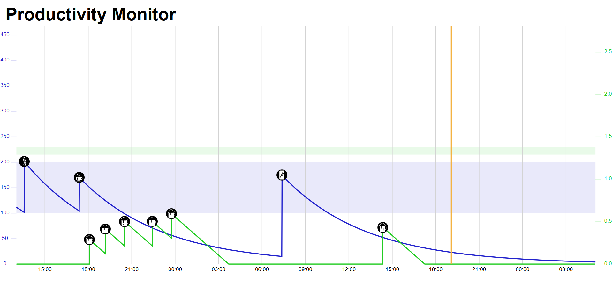

# Productivity Bot
## Disclaimer
This is a fun project that we created for [HackHPI 2017](https://hackhpi.org/2017/). It is not meant to be actual medical advice.

  
## How it works
Tell Alexa which beverages you are consuming. According to your weight and sex, the ProductivityBot will calculate your ideal level of alcohol and caffeine, and "help you stay in you [Ballmer Peak](https://xkcd.com/323/)". Alexa will tell you your alcohol and caffeine level and give recommendations about which beverages to consume to reach your maximum productivity. Besides the voice feedback, a website depicts your caffeine and alcohol level over time.

  

